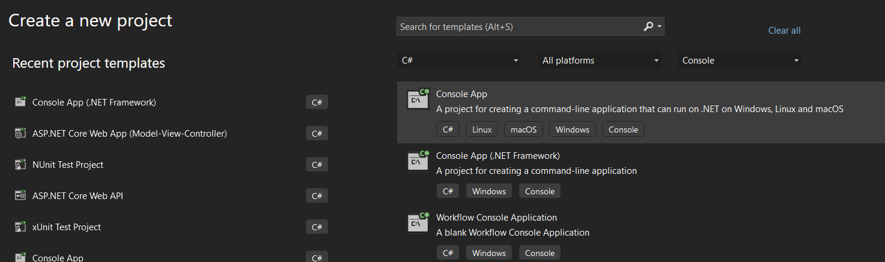
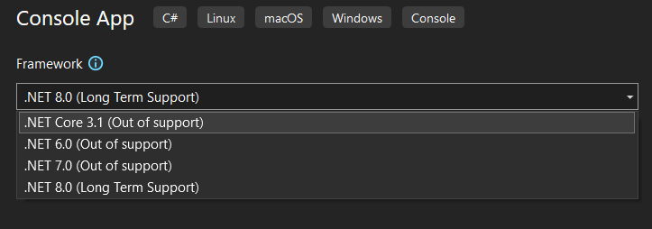

# Exmample to implement Multiple inheritance
```cs
public class Customer
{
    public int CustomerId { get; set; }
    public string CustomerName { get; set; }
    public string CustomerCity { get; set; }
}

   public class Seller
{
    public int SellerId  { get; set; }
    public string SellerName { get; set; }
    public string ProductName { get; set; }
}

public class ABCCommerce:Customer,Seller   // Error  C# cannot have multiple base class
{ }

```
To acheive the Multiple inheritance we can use Interface 
# What is Interface
An interface is a contract that defines a set of members (methods, properties, events, or indexers) without implementing them (though this has changed slightly in C# 8+). Any class or struct that implements the interface must provide implementations for all its members.

Think of an interface as a blueprint or protocol that tells a class what to do, but not how to do it.
🔷 Syntax
```cs
public interface IShape
{
    double Area();
    double Perimeter();
}
```
🔷 Implementing an Interface
```cs
public class Circle : IShape
{
    public double Radius { get; set; }

    public Circle(double radius)
    {
        Radius = radius;
    }

    public double Area()
    {
        return Math.PI * Radius * Radius;
    }

    public double Perimeter()
    {
        return 2 * Math.PI * Radius;
    }
}
```
| Feature              | Interface                                         | Class                                                |
|----------------------|---------------------------------------------------|------------------------------------------------------|
| Inheritance          | Can only inherit from other interfaces            | Can inherit from classes and implement interfaces    |
| Implementation       | No implementation (except default methods from C# 8+) | Contains full implementation                        |
| Constructors         | ❌ Not allowed                                     | ✅ Supported                                          |
| Fields               | ❌ Not allowed                                     | ✅ Supported                                          |
| Multiple Inheritance | ✅ Supports multiple interfaces                    | ❌ Only single class inheritance                     |
| Access Modifiers     | Only public members allowed                       | Can have private, protected, internal, etc.          |
| Instantiation        | ❌ Cannot be instantiated                          | ✅ Can be instantiated                               |


Next Let us Modify our Program using interface

Consoleapp using .Net Framework 4.7.2
```cs
 public interface ICustomerActions
 {
     //act like abstract method
     void AddToCart(string productName);
     //concrete method
     void Placeorder() //Error Default implementation does not allowed in C# 7.3
     {
         Console.WriteLine("order placed");
     }

 }
 ```

 Let us create Console app using .NET Core 8.0
 

 

 ```cs

 using System;
using System.Collections.Generic;
using System.Linq;
using System.Text;
using System.Threading.Tasks;

namespace Multipleinheritance_Demo_version8
{
    public interface ICustomerActions
    {
        void AddToCart(string productname);
        void PlaceOrcer()
        {
            Console.WriteLine("Order Placed");
        }
    }

    public interface IReviewActions
    {
        void WriteReview(string product, string review);
    }

    public class Person
    {

        public string Name { get; set; } = "Test Person";
        public string City { get; set; } = "Mumbai";
        public void PersonInfo()
        {
            Console.WriteLine($"Name : {Name} \n City= {City}");
        }
    }
    public class Customer :Person, ICustomerActions, IReviewActions
    {
        public string CustomerName { get; set; }
        //public string[] cart = new string[10];
        //int cartCount = 0;
        public void AddToCart(string productName)
        {

            Console.WriteLine($"{productName}  added  to the Cart");
        }
        public void WriteReview(string product,string review)
        {
            Console.WriteLine($"Review for the {product} is {review}" );
        }
        
        public void CusotmerInfo()
        {
            Console.WriteLine($"Customer Name : {CustomerName} ");
             
        }
    }
}
```
program.cs
```cs
// See https://aka.ms/new-console-template for more information
//Console.WriteLine("Hello, World!");

using Multipleinheritance_Demo_version8;

Customer customer=new Customer();
customer.CustomerName = "Test Cusotmer";
customer.CusotmerInfo();
customer.PersonInfo();
customer.AddToCart("Laptop");
customer.WriteReview("Laptop", "Good for the cost");
Console.ReadLine();
```

# Abstract  Class
```cs
using System;
using System.Collections.Generic;
using System.Linq;
using System.Text;
using System.Threading.Tasks;

namespace Abstract_Class_Demo
{
    public abstract class Employee
    {
        public string Name { get; set; }
        public int Id { get; set; }

        public Employee(int id,string name)
        {
            this.Name = name;   
            this.Id = id;
        }
        public abstract double CalculateSalary();

        public void EmployeeInfo()
        {
            Console.WriteLine($"Id={Id} \nName={Name}");
        }
    }

    public  class FullTimeEmployee:Employee
    {

        public double AnnualSalary { get; set; }

        public FullTimeEmployee(int id, string name,double annualSalary):base(id,name)
        {
            this.AnnualSalary = annualSalary;
            
        }
        public override double CalculateSalary()
        {
            return this.AnnualSalary / 12;
        }
    }

    public class PartTimemeployee : Employee
    {
        public double HourlyRate { get; set; }
        public int HoursWorked { get; set; }
        public PartTimemeployee(int id, string name, double hourlyRate, int hoursWorked):base(id,name) 
        {
            this.HourlyRate = hourlyRate;
            this.HoursWorked = hoursWorked;
        }
        public override double CalculateSalary()
        {
            return HoursWorked * HourlyRate;
        }
    }
}

```

Program.cs

```cs
// See https://aka.ms/new-console-template for more information

using Abstract_Class_Demo;
Console.WriteLine("Full time Employee Info\n");
Employee employee = new FullTimeEmployee(1,"Raja",890000);
//FullTimeEmployee employee=new FullTimeEmployee(1,"Raja",7899990);
employee.EmployeeInfo();
Console.WriteLine($"Monthly Salary = {employee.CalculateSalary()}");

//employee = new PartTimemeployee(2,"Peter",4000,300);
Console.WriteLine("\nPart time Employee Info\n");
employee.EmployeeInfo();
Console.WriteLine($"Salary for Part time Employee {employee.CalculateSalary()}");
  
Console.ReadLine();

```