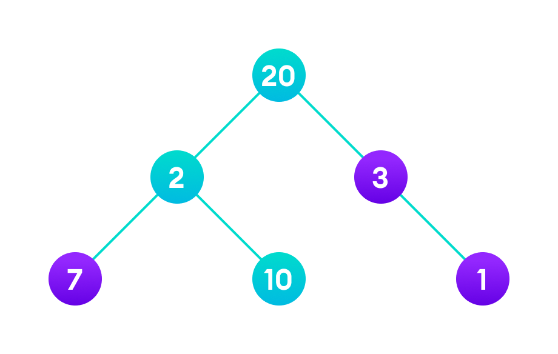

# Greedy Algorithm
A greedy algorithm is an approach for solving a problem by selecting the best option available at the moment. It doesn't worry whether the current best result will bring the overall optimal result.

The algorithm never reverses the earlier decision even if the choice is wrong. It works in a top-down approach.

This algorithm may not produce the best result for all the problems. It's because it always goes for the local best choice to produce the global best result.

However, we can determine if the algorithm can be used with any problem if the problem has the following properties:

## 1. Greedy Choice Property

If an optimal solution to the problem can be found by choosing the best choice at each step without reconsidering the previous steps once chosen, the problem can be solved using a greedy approach. This property is called greedy choice property.

## 2. Optimal Substructure
If the optimal overall solution to the problem corresponds to the optimal solution to its subproblems, then the problem can be solved using a greedy approach. This property is called optimal substructure.

## Advantages of Greedy Approach
The algorithm is easier to describe.

This algorithm can perform better than other algorithms (but, not in all cases).

### Drawback of Greedy Approach
As mentioned earlier, the greedy algorithm doesn't always produce the optimal solution. This is the major disadvantage of the algorithm.

For example, suppose we want to find the longest path in the graph below from root to leaf. Let's use the greedy algorithm here.

# Greedy Approach

1. Let's start with the root node 20. The weight of the right child is 3 and the weight of the left child is 2.

2. Our problem is to find the largest path. And, the optimal solution at the moment is 3. So, the greedy algorithm will choose 3.

3. Finally the weight of an only child of 3 is 1. This gives us our final result 20 + 3 + 1 = 24.

However, it is not the optimal solution. There is another path that carries more weight (20 + 2 + 10 = 32) as shown in the image below.

Therefore, greedy algorithms do not always give an optimal/feasible solution.
## Greedy Algorithm
To begin with, the solution set (containing answers) is empty.

At each step, an item is added to the solution set until a solution is reached.

If the solution set is feasible, the current item is kept.

Else, the item is rejected and never considered again.

Let's now use this algorithm to solve a problem.    
## Example - Greedy Approach

Problem: You have to make a change of an amount using the smallest possible number of coins.
Amount: $18

Available coins are
  $5 coin
  $2 coin
  $1 coin
There is no limit to the number of each coin you can use.

## Solution:

Create an empty solution-set = { }. Available coins are {5, 2, 1}.

We are supposed to find the sum = 18. Let's start with sum = 0.

Always select the coin with the largest value (i.e. 5) until the sum > 18. (When we select the largest value at each step, we hope to reach the destination faster. This concept is called greedy choice property.)

In the first iteration, solution-set = {5} and sum = 5.

In the second iteration, solution-set = {5, 5} and sum = 10.

In the third iteration, solution-set = {5, 5, 5} and sum = 15.

In the fourth iteration, solution-set = {5, 5, 5, 2} and sum = 17. (We cannot select 5 here because if we do so, sum = 20 which is greater than 18. So, we select the 2nd largest item which is 2.)

Similarly, in the fifth iteration, select 1. Now sum = 18 and solution-set = {5, 5, 5, 2, 1}.

## Assignment 1: using greedy approach
Event Planning with a Greedy Approach
Problem Statement:
You are an event manager planning a conference schedule. You have multiple talks proposed by different speakers, each with a start and end time. Your goal is to select the maximum number of non-overlapping talks to maximize the number of sessions attended by visitors.

Constraints:
Each talk has a fixed start time and end time.

A visitor can only attend one talk at a time (no overlapping).

Your job is to create a schedule that allows the maximum number of talks to be conducted in a single conference hall.

## Example Input:

You receive a list of talks with their scheduled times:

| Talk | Start Time | End Time   |
|------|------------|------------|
| T1   | 9:00 AM   | 10:30 AM   |
| T2   | 10:00 AM  | 11:00 AM   |
| T3   | 10:45 AM  | 12:00 PM   |
| T4   | 11:30 AM  | 1:00 PM    |
| T5   | 1:00 PM   | 2:30 PM    |

## Assignment 2:
Task Scheduling with Deadlines (Greedy Approach)
Problem Statement:
A company has several tasks to complete, each with a profit and a deadline (number of days before it must be completed). You have only one worker who can complete one task per day. Your goal is to maximize total profit by selecting the most profitable tasks while ensuring they are finished within their deadlines.

# Constraints:
Each task takes one full day to complete.

The deadline is the last day the task can be completed.

If multiple tasks are available on a day, choose the one with the highest profit.

Total days available = maximum deadline among tasks.

## Example Input:
| Task | Deadline (days) | Profit ($) |
|------|---------------|------------|
| T1   | 4             | 20         |
| T2   | 1             | 10         |
| T3   | 2             | 40         |
| T4   | 2             | 30         |
